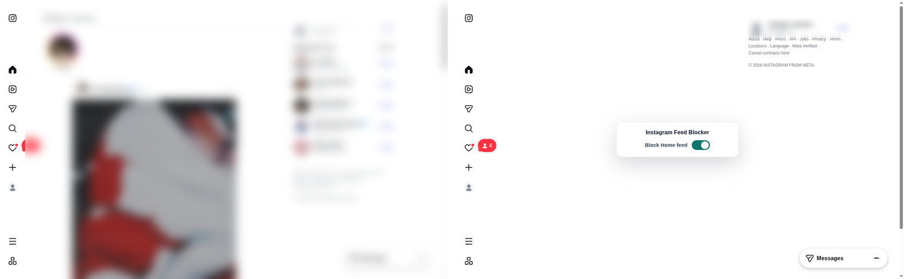

<div align="center">


# Instagram Feed Blocker

Hide Instagram's feed, stories, suggestions, Explore grid and Reels on desktop.
Messages, search, profiles and the posts people send you keep working.

</div>

## Before and after



The feed on the left is blurred on purpose. It is other people's content.

## What gets blocked

| Page    | Hidden                                                                          | Paused        |
| ------- | ------------------------------------------------------------------------------- | ------------- |
| Home    | posts and suggested posts, the For you and Following tabs, stories, Suggested for you | feed videos   |
| Explore | the grid and its tabs, while the search box and its results stay                | grid previews |
| Reels   | the Reels tab                                                                   | the player    |

The feed, stories, suggestions, Explore and Reels each have their own switch.
Turning one off puts back what was there, including whether a video was playing
and muted.

Messages, notifications, profiles, search, and a post or reel opened from a link
are never touched.

## Three ways to flip a switch

**The popup.** A switch for everything, one per section, and one to hide the
in-page card.

**On the page.** A blocked page shows a card with its switch. Turn it off, and a
small Block button at the bottom brings the block back.

**The keyboard.** <kbd>Ctrl</kbd> + <kbd>Shift</kbd> + <kbd>9</kbd> toggles the
page you are on, or <kbd>⌘</kbd> + <kbd>Shift</kbd> + <kbd>9</kbd> on macOS.
Rebind it at `chrome://extensions/shortcuts`.

## Privacy

Settings stay in the browser's local extension storage. The extension makes no
network requests of its own, and it asks only for `storage`, `activeTab` and
access to `instagram.com`. The Firefox build declares that it collects no data.

## Install from source

It is not in any extension store yet.

```sh
pnpm install
pnpm build           # Chromium, into dist/
pnpm build:firefox   # Firefox, into dist-firefox/
```

In Chrome or another Chromium browser, open `chrome://extensions`, turn on
Developer mode and load `dist/` as an unpacked extension. In Firefox, load
`dist-firefox/manifest.json` from `about:debugging` as a temporary add-on. The
Firefox build gets less testing than the Chromium one.

Want to help? Start with [CONTRIBUTING.md](CONTRIBUTING.md).

## License

[MIT](LICENSE)
